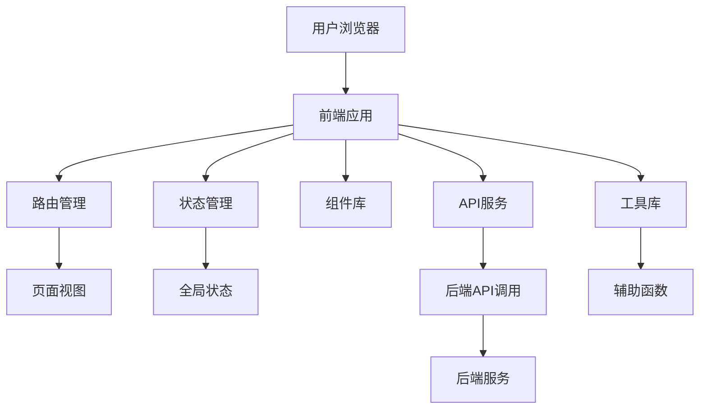
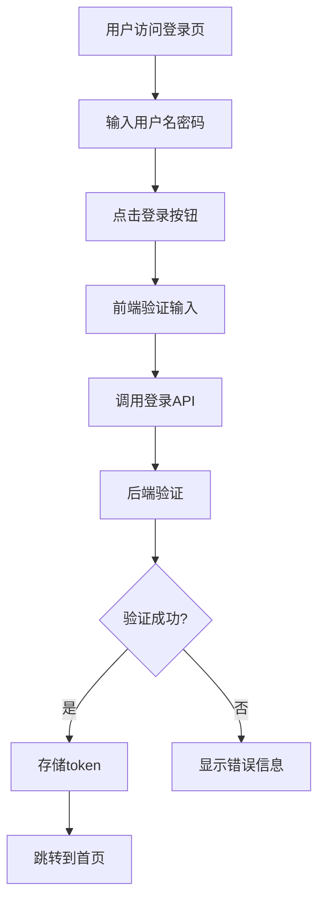
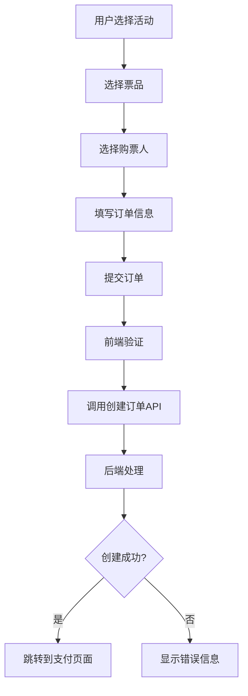

# 智联票务系统前端设计文档

## 1. 系统概述

### 1.1 系统简介
智联票务系统前端是一个基于现代Web技术构建的票务预订平台，与后端系统紧密配合，为用户提供便捷、高效的票务预订体验。系统支持用户注册登录、购票人管理、订单管理、支付处理、图片上传等核心功能，并集成AI智能体提供智能推荐和客服服务。

### 1.2 设计目标
- **用户体验**：提供直观、流畅的用户界面，确保用户操作简单快捷
- **响应式设计**：适配不同设备屏幕，提供一致的使用体验
- **性能优化**：减少页面加载时间，提高交互响应速度
- **安全性**：保护用户数据安全，防止前端攻击
- **可维护性**：采用模块化设计，便于代码维护和扩展
- **AI集成**：无缝集成AI智能体功能，提升用户体验

### 1.3 业务范围
- 用户管理：注册、登录、个人信息管理
- 购票人管理：添加、查询、修改、删除购票人信息
- 订单管理：创建订单、支付订单、查询订单、取消订单
- 支付处理：微信支付、支付宝支付
- 图片管理：上传、查看、删除图片
- 基础数据：地区选择、渠道管理
- AI服务：智能推荐、智能客服

## 2. 技术架构

### 2.1 技术选型

| 类别 | 技术 | 版本 | 选型理由 |
| :--- | :--- | :--- | :--- |
| 基础框架 | Vue.js | 3.x | 轻量级前端框架，响应式数据绑定，组件化开发 |
| 状态管理 | Pinia | 2.x | Vue 3官方推荐的状态管理库，性能优于Vuex |
| 路由管理 | Vue Router | 4.x | Vue官方路由库，支持嵌套路由、路由守卫等功能 |
| UI框架 | Element Plus | 2.x | 基于Vue 3的UI组件库，提供丰富的组件和主题定制 |
| HTTP客户端 | Axios | 1.x | 功能强大的HTTP客户端，支持拦截器、请求取消等功能 |
| 构建工具 | Vite | 4.x | 快速的前端构建工具，提供热更新、按需编译等特性 |
| 样式预处理器 | SCSS | 1.x | 增强CSS功能，支持变量、嵌套、混合等特性 |
| 代码规范 | ESLint + Prettier | - | 统一代码风格，提高代码质量 |
| 测试工具 | Vitest | 0.30+ | 基于Vite的测试框架，速度快，配置简单 |
| AI集成 | OpenAI API | - | 集成AI智能体功能 |

### 2.2 系统架构图



### 2.3 核心组件设计

#### 2.3.1 模块划分

| 模块名称 | 主要功能 | 目录路径 |
| :--- | :--- | :--- |
| 系统核心 | 全局配置、工具类、路由管理 | src/core |
| 用户模块 | 用户注册、登录、个人信息管理 | src/modules/user |
| 购票人模块 | 购票人信息管理 | src/modules/buyer |
| 订单模块 | 订单创建、支付、查询、取消 | src/modules/order |
| 支付模块 | 支付处理、回调处理 | src/modules/payment |
| 图片模块 | 图片上传、预览、删除 | src/modules/image |
| 基础数据模块 | 地区选择、渠道管理 | src/modules/base |
| 监控模块 | 系统监控、健康检查 | src/modules/monitor |
| AI模块 | 智能推荐、智能客服 | src/modules/ai |

#### 2.3.2 关键技术实现

1. **响应式设计**
   - 使用Element Plus的响应式组件
   - 采用CSS Grid和Flexbox布局
   - 实现移动端适配

2. **状态管理**
   - 使用Pinia管理全局状态
   - 实现模块化状态管理
   - 支持状态持久化

3. **API调用**
   - 使用Axios封装API请求
   - 实现请求拦截器和响应拦截器
   - 统一错误处理

4. **性能优化**
   - 组件懒加载
   - 图片懒加载
   - 路由懒加载
   - 缓存策略

5. **安全性**
   - XSS防护
   - CSRF防护
   - 敏感信息加密
   - 输入验证

## 3. 页面设计

### 3.1 页面结构

| 页面名称 | 模块/文件 | 功能描述 | 路由 |
| :--- | :--- | :--- | :--- |
| 首页 | src/views/Home.vue | 系统主页，展示热门活动和推荐 | / |
| 登录页 | src/views/auth/Login.vue | 用户登录 | /auth/login |
| 注册页 | src/views/auth/Register.vue | 用户注册 | /auth/register |
| 个人中心 | src/views/user/Profile.vue | 个人信息管理 | /user/profile |
| 购票人管理 | src/views/buyer/List.vue | 购票人信息管理 | /buyer/list |
| 订单列表 | src/views/order/List.vue | 订单列表查询 | /order/list |
| 订单详情 | src/views/order/Detail.vue | 订单详情查看 | /order/detail/:id |
| 创建订单 | src/views/order/Create.vue | 创建新订单 | /order/create |
| 支付页面 | src/views/payment/Pay.vue | 订单支付 | /payment/pay/:id |
| 图片上传 | src/views/image/Upload.vue | 图片上传管理 | /image/upload |
| 地区选择 | src/views/base/Region.vue | 地区选择组件 | /base/region |
| 渠道管理 | src/views/base/Channel.vue | 渠道管理 | /base/channel |
| AI智能助手 | src/views/ai/Assistant.vue | AI智能客服 | /ai/assistant |

### 3.2 页面流程图

**用户登录流程**


**订单创建流程**


### 3.3 关键页面设计

#### 3.3.1 登录页面
- **布局**：居中表单布局，包含用户名、密码输入框，验证码输入框，登录按钮
- **功能**：用户登录、忘记密码、注册链接
- **交互**：输入验证、登录状态反馈、错误提示

#### 3.3.2 订单列表页面
- **布局**：表格布局，展示订单列表，包含订单号、金额、状态、创建时间等字段
- **功能**：订单查询、筛选、排序、详情查看
- **交互**：分页加载、状态筛选、订单详情跳转

#### 3.3.3 订单详情页面
- **布局**：卡片式布局，展示订单基本信息、订单明细、支付信息
- **功能**：查看订单详情、支付订单、取消订单
- **交互**：状态更新、支付跳转、操作确认

#### 3.3.4 购票人管理页面
- **布局**：表格布局，展示购票人列表，包含姓名、身份证号、手机号等字段
- **功能**：添加、编辑、删除购票人信息
- **交互**：表单验证、操作确认、批量操作

#### 3.3.5 AI智能助手页面
- **布局**：聊天界面，包含消息列表、输入框、发送按钮
- **功能**：智能问答、票务推荐、问题解决
- **交互**：消息发送、语音输入、AI响应展示

## 4. API调用设计

### 4.1 API服务封装

```javascript
// src/services/api.js
import axios from 'axios'
import { useUserStore } from '@/stores/user'

const api = axios.create({
  baseURL: '/api',
  timeout: 10000
})

// 请求拦截器
api.interceptors.request.use(
  config => {
    const userStore = useUserStore()
    if (userStore.token) {
      config.headers.Authorization = `Bearer ${userStore.token}`
    }
    return config
  },
  error => {
    return Promise.reject(error)
  }
)

// 响应拦截器
api.interceptors.response.use(
  response => {
    return response.data
  },
  error => {
    if (error.response) {
      switch (error.response.status) {
        case 401:
          // 未授权，跳转到登录页
          break
        case 403:
          // 禁止访问
          break
        case 404:
          // 资源不存在
          break
        case 500:
          // 服务器错误
          break
        default:
          // 其他错误
          break
      }
    }
    return Promise.reject(error)
  }
)

export default api
```

### 4.2 模块API调用

#### 4.2.1 用户模块API
```javascript
// src/services/user.js
import api from './api'

export const userService = {
  register(data) {
    return api.post('/user/register', data)
  },
  login(data) {
    return api.post('/user/login', data)
  },
  verify() {
    return api.get('/user/verify')
  },
  getInfo() {
    return api.get('/user/info')
  },
  update(data) {
    return api.put('/user/update', data)
  }
}
```

#### 4.2.2 订单模块API
```javascript
// src/services/order.js
import api from './api'

export const orderService = {
  create(data) {
    return api.post('/order/create', data)
  },
  pay(data) {
    return api.post('/order/pay', data)
  },
  cancel(data) {
    return api.post('/order/cancel', data)
  },
  list() {
    return api.get('/order/list')
  },
  detail(id) {
    return api.get(`/order/detail?id=${id}`)
  },
  close(data) {
    return api.post('/order/close', data)
  }
}
```

#### 4.2.3 支付模块API
```javascript
// src/services/payment.js
import api from './api'

export const paymentService = {
  wxPay(data) {
    return api.post('/pay/wx', data)
  },
  aliPay(data) {
    return api.post('/pay/alipay', data)
  },
  getResult(orderId) {
    return api.get(`/pay/result?orderId=${orderId}`)
  }
}
```

## 5. 状态管理设计

### 5.1 Pinia状态管理

```javascript
// src/stores/user.js
import { defineStore } from 'pinia'
import { userService } from '@/services/user'

export const useUserStore = defineStore('user', {
  state: () => ({
    token: localStorage.getItem('token') || '',
    userInfo: null,
    isLoggedIn: false
  }),
  getters: {
    getToken: (state) => state.token,
    getUserInfo: (state) => state.userInfo,
    getIsLoggedIn: (state) => state.isLoggedIn
  },
  actions: {
    async login(username, password) {
      const response = await userService.login({ username, password })
      if (response.code === 200) {
        this.token = response.data.token
        this.userInfo = response.data.user
        this.isLoggedIn = true
        localStorage.setItem('token', response.data.token)
        return true
      }
      return false
    },
    async logout() {
      this.token = ''
      this.userInfo = null
      this.isLoggedIn = false
      localStorage.removeItem('token')
    },
    async getInfo() {
      const response = await userService.getInfo()
      if (response.code === 200) {
        this.userInfo = response.data.user
        return response.data.user
      }
      return null
    }
  }
})
```

### 5.2 订单状态管理

```javascript
// src/stores/order.js
import { defineStore } from 'pinia'
import { orderService } from '@/services/order'

export const useOrderStore = defineStore('order', {
  state: () => ({
    orders: [],
    currentOrder: null,
    loading: false
  }),
  getters: {
    getOrders: (state) => state.orders,
    getCurrentOrder: (state) => state.currentOrder,
    getLoading: (state) => state.loading
  },
  actions: {
    async fetchOrders() {
      this.loading = true
      try {
        const response = await orderService.list()
        if (response.code === 200) {
          this.orders = response.data
        }
      } finally {
        this.loading = false
      }
    },
    async fetchOrderDetail(id) {
      this.loading = true
      try {
        const response = await orderService.detail(id)
        if (response.code === 200) {
          this.currentOrder = response.data
        }
      } finally {
        this.loading = false
      }
    },
    async createOrder(data) {
      this.loading = true
      try {
        const response = await orderService.create(data)
        if (response.code === 200) {
          return response.data
        }
        return null
      } finally {
        this.loading = false
      }
    }
  }
})
```

## 6. 性能优化策略

### 6.1 前端性能优化

1. **代码分割**
   - 路由懒加载
   - 组件懒加载
   - 第三方库按需引入

2. **资源优化**
   - 图片压缩
   - 图片懒加载
   - 静态资源缓存

3. **渲染优化**
   - 使用虚拟列表处理长列表
   - 减少DOM操作
   - 使用CSS动画代替JavaScript动画

4. **网络优化**
   - API请求合并
   - 缓存API响应
   - 使用CDN加速静态资源

### 6.2 构建优化

1. **Vite配置优化**
   - 配置别名
   - 开启GZIP压缩
   - 优化打包大小

2. **代码规范**
   - ESLint代码检查
   - Prettier代码格式化
   - TypeScript类型检查

3. **测试优化**
   - 单元测试
   - 端到端测试
   - 性能测试

## 7. 安全性设计

### 7.1 前端安全措施

1. **XSS防护**
   - 输入验证
   - 输出编码
   - 使用安全的DOM操作方法

2. **CSRF防护**
   - 使用CSRF token
   - 验证请求来源
   -  SameSite cookie设置

3. **敏感信息保护**
   - 密码加密传输
   - 不在本地存储敏感信息
   - 使用HTTPS

4. **权限控制**
   - 前端路由守卫
   - 接口权限验证
   - 操作权限检查

### 7.2 安全最佳实践

1. **输入验证**
   - 客户端输入验证
   - 服务端输入验证
   - 正则表达式验证

2. **错误处理**
   - 统一错误处理
   - 不暴露详细错误信息
   - 错误日志记录

3. **依赖管理**
   - 定期更新依赖
   - 检查依赖安全漏洞
   - 使用安全的依赖版本

## 8. 部署方案

### 8.1 构建与部署

1. **构建流程**
   - 开发环境构建：`npm run dev`
   - 测试环境构建：`npm run build:test`
   - 生产环境构建：`npm run build:prod`

2. **部署方式**
   - 静态文件部署：部署到Nginx或CDN
   - 容器化部署：使用Docker容器
   - CI/CD集成：使用Jenkins或GitHub Actions

3. **环境配置**
   - 开发环境：`.env.development`
   - 测试环境：`.env.test`
   - 生产环境：`.env.production`

### 8.2 监控与维护

1. **前端监控**
   - 错误监控：Sentry
   - 性能监控：Lighthouse
   - 用户行为分析：Google Analytics

2. **日志管理**
   - 前端日志收集
   - 错误日志分析
   - 性能日志监控

3. **维护策略**
   - 定期更新依赖
   - 代码审查
   - 性能优化

## 9. 总结与展望

### 9.1 系统优势

- **用户体验**：响应式设计，流畅的交互体验
- **性能优化**：代码分割、资源优化、渲染优化
- **安全性**：多层次的安全防护措施
- **可维护性**：模块化设计，代码规范
- **AI集成**：智能推荐、智能客服

### 9.2 未来规划

- **PWA支持**：实现渐进式Web应用，支持离线访问
- **移动端适配**：开发响应式移动端界面
- **多语言支持**：国际化实现
- **深色模式**：支持深色主题
- **AI功能增强**：更智能的推荐算法、更自然的客服交互
- **无障碍访问**：支持无障碍功能，提高可访问性

---

**文档版本**：v1.0
**编写日期**：2026-03-24
**编写团队**：智联票务技术团队