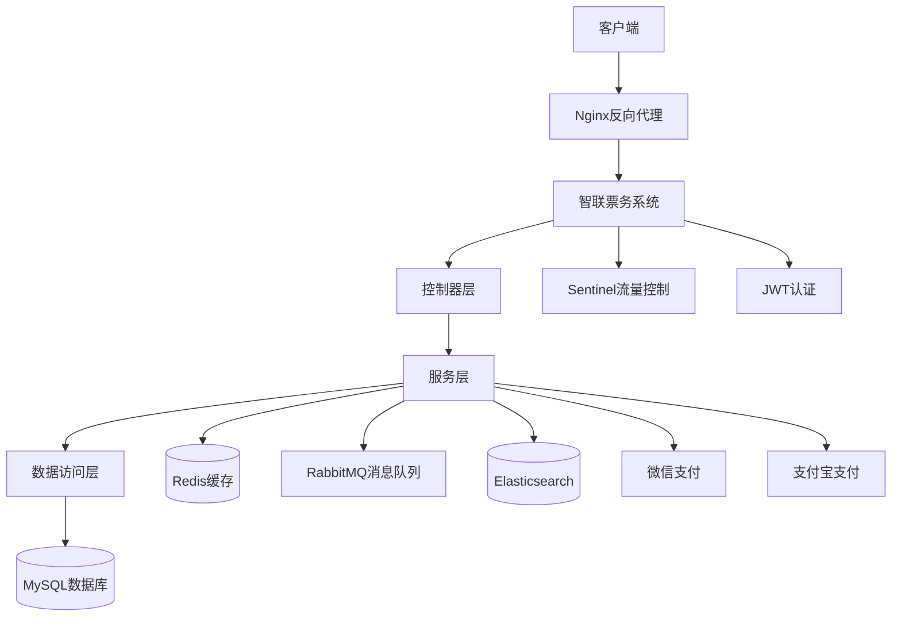

# 智联票务系统后端设计文档

## 1. 系统概述

### 1.1 系统简介
智联票务系统是一个基于传统售票服务系统，集成AI智能体的高性能票务平台，旨在解决高并发场景下的票务处理问题。系统支持用户注册登录、购票人管理、图形验证码、网关防护、基础数据管理、服务监控、支付处理和订单管理等核心功能。

### 1.2 设计目标
- **高并发处理**：支持大规模并发请求，确保系统稳定运行
- **安全性**：实现数据加密、防攻击、防刷等安全措施
- **可扩展性**：采用微服务架构，支持横向扩展
- **可靠性**：确保系统高可用，数据一致性
- **性能优化**：通过缓存、异步处理等技术提升系统性能

### 1.3 业务范围
- 用户服务：注册、登录、验证、数据加密
- 购票人服务：注册、查询、删除
- 图形验证码服务：获取与验证
- 网关服务：防攻击、防刷、登录验证、数据加密
- 基础数据服务：地区数据、省市区查询、节点查询、渠道数据管理
- 服务监听：邮箱通知、服务信息查询、健康检查
- 支付服务：微信/支付宝支付、回调处理、结果返回
- 订单服务：生成、支付、异步操作、取消、查询、关闭、多维度组合
- 图片服务：图片上传、存储、访问

## 2. 技术架构

### 2.1 技术选型

| 类别 | 技术 | 版本 | 选型理由 |
| :--- | :--- | :--- | :--- |
| 基础框架 | Spring Boot | 2.7.x | 快速构建单体应用，提供丰富的生态支持 |
| 服务治理 | Sentinel | 1.8.x | 流量控制、熔断降级，保障系统稳定性 |
| 日志框架 | Log4j2 | 2.17.x | 高性能日志处理，支持异步日志 |
| 数据库 | MySQL | 8.0 | 关系型数据库，适合票务系统的数据存储需求 |
| ORM框架 | MyBatis-Plus | 3.5.x | 增强版MyBatis，简化CRUD操作 |
| 验证码 | AJ-Captcha | 1.0.x | 提供图形验证码功能，防止恶意请求 |
| 消息队列 | RabbitMQ | 3.8.x | 异步处理任务，削峰填谷，提高系统吞吐量 |
| 缓存 | Redis | 7.0+ | 高性能缓存，减轻数据库压力，提升响应速度 |
| 分布式锁 | Redisson | 3.17.x | 实现并发环境下的锁机制，保证数据一致性 |
| 搜索引擎 | Elasticsearch | 7.17.x | 提供高效的搜索能力，支持复杂查询 |
| 容器化 | Docker | 20.10+ | 实现应用容器化，简化部署和管理 |
| 反向代理 | Nginx | 1.20+ | 负载均衡，提高系统可用性和性能 |
| 认证 | JWT | - | 无状态认证，便于系统扩展 |
| 工具库 | Lombok | 1.18.x | 减少样板代码，提高开发效率 |
| 工具库 | Hutool | 5.8.x | 提供丰富的工具方法，简化开发 |
| API文档 | Swagger + Knife4j | 3.0.x | 自动生成API文档，便于接口管理和测试 |

### 2.2 系统架构图

### 2.3 核心组件设计

#### 2.3.1 模块划分

| 模块名称 | 主要功能 | 包路径 |
| :--- | :--- | :--- |
| 系统核心 | 全局配置、工具类、异常处理 | com.zhilian.core |
| 用户模块 | 用户注册、登录、验证、数据加密 | com.zhilian.user |
| 购票人模块 | 购票人注册、查询、删除 | com.zhilian.buyer |
| 图形验证码模块 | 图形验证码生成与验证 | com.zhilian.captcha |
| 基础数据模块 | 地区数据、省市区查询、节点查询、渠道数据 | com.zhilian.base |
| 订单模块 | 订单生成、支付、异步操作、取消、查询、关闭 | com.zhilian.order |
| 支付模块 | 微信/支付宝支付、回调处理、结果返回 | com.zhilian.payment |
| 图片模块 | 图片上传、存储、访问 | com.zhilian.image |
| 监控模块 | 邮箱通知、服务信息查询、健康检查 | com.zhilian.monitor |

#### 2.3.2 关键技术实现

1. **高并发处理**
   - 使用Redis实现缓存，减轻数据库压力
   - 采用RabbitMQ实现异步处理，削峰填谷
   - 使用Sentinel进行流量控制和熔断降级
   - 实现分布式锁，保证数据一致性

2. **安全性**
   - 使用JWT进行无状态认证
   - 实现数据加密，保护敏感信息
   - 集成AJ-Captcha，防止恶意请求
   - 实现防攻击、防刷机制

3. **可靠性**
   - 采用MySQL主从复制，保证数据可靠性
   - 实现服务降级和容错机制
   - 定期数据备份和恢复策略

4. **可维护性**
   - 基于Spring Boot的单体架构，结构清晰
   - 模块化设计，便于代码维护和扩展
   - 使用Docker容器化部署，简化部署流程

## 3. 数据库设计

### 3.1 数据库表结构

#### 3.1.1 用户表（user）

| 字段名 | 数据类型 | 约束 | 描述 |
| :--- | :--- | :--- | :--- |
| id | BIGINT | PRIMARY KEY, AUTO_INCREMENT | 用户ID |
| username | VARCHAR(50) | UNIQUE, NOT NULL | 用户名 |
| password | VARCHAR(100) | NOT NULL | 密码（加密存储） |
| mobile | VARCHAR(11) | UNIQUE, NOT NULL | 手机号 |
| email | VARCHAR(100) | UNIQUE | 邮箱 |
| nickname | VARCHAR(50) | | 昵称 |
| avatar | VARCHAR(255) | | 头像URL |
| status | TINYINT | DEFAULT 1 | 状态（1-正常，0-禁用） |
| create_time | DATETIME | DEFAULT CURRENT_TIMESTAMP | 创建时间 |
| update_time | DATETIME | DEFAULT CURRENT_TIMESTAMP ON UPDATE CURRENT_TIMESTAMP | 更新时间 |

#### 3.1.2 购票人表（buyer）

| 字段名 | 数据类型 | 约束 | 描述 |
| :--- | :--- | :--- | :--- |
| id | BIGINT | PRIMARY KEY, AUTO_INCREMENT | 购票人ID |
| user_id | BIGINT | NOT NULL, FOREIGN KEY | 用户ID |
| name | VARCHAR(50) | NOT NULL | 姓名 |
| id_card | VARCHAR(18) | NOT NULL | 身份证号 |
| mobile | VARCHAR(11) | NOT NULL | 手机号 |
| create_time | DATETIME | DEFAULT CURRENT_TIMESTAMP | 创建时间 |
| update_time | DATETIME | DEFAULT CURRENT_TIMESTAMP ON UPDATE CURRENT_TIMESTAMP | 更新时间 |

#### 3.1.3 订单表（order）

| 字段名 | 数据类型 | 约束 | 描述 |
| :--- | :--- | :--- | :--- |
| id | BIGINT | PRIMARY KEY, AUTO_INCREMENT | 订单ID |
| order_no | VARCHAR(32) | UNIQUE, NOT NULL | 订单号 |
| user_id | BIGINT | NOT NULL, FOREIGN KEY | 用户ID |
| event_id | BIGINT | NOT NULL, FOREIGN KEY | 演出活动ID |
| total_amount | DECIMAL(10,2) | NOT NULL | 总金额 |
| status | TINYINT | DEFAULT 0 | 状态（0-待支付，1-已支付，2-已取消，3-已完成） |
| pay_type | TINYINT | | 支付方式（1-微信，2-支付宝） |
| pay_time | DATETIME | | 支付时间 |
| create_time | DATETIME | DEFAULT CURRENT_TIMESTAMP | 创建时间 |
| update_time | DATETIME | DEFAULT CURRENT_TIMESTAMP ON UPDATE CURRENT_TIMESTAMP | 更新时间 |

#### 3.1.4 订单明细���（order_item）

| 字段名 | 数据类型 | 约束 | 描述 |
| :--- | :--- | :--- | :--- |
| id | BIGINT | PRIMARY KEY, AUTO_INCREMENT | 明细ID |
| order_id | BIGINT | NOT NULL, FOREIGN KEY | 订单ID |
| buyer_id | BIGINT | NOT NULL, FOREIGN KEY | 购票人ID |
| ticket_id | BIGINT | NOT NULL, FOREIGN KEY | 票品ID |
| seat_info | VARCHAR(100) | NOT NULL | 座位信息 |
| price | DECIMAL(10,2) | NOT NULL | 票价 |
| create_time | DATETIME | DEFAULT CURRENT_TIMESTAMP | 创建时间 |

#### 3.1.5 地区表（region）

| 字段名 | 数据类型 | 约束 | 描述 |
| :--- | :--- | :--- | :--- |
| id | BIGINT | PRIMARY KEY, AUTO_INCREMENT | 地区ID |
| name | VARCHAR(50) | NOT NULL | 地区名称 |
| parent_id | BIGINT | | 父级地区ID |
| level | TINYINT | NOT NULL | 地区级别（1-省，2-市，3-区/县） |
| create_time | DATETIME | DEFAULT CURRENT_TIMESTAMP | 创建时间 |

#### 3.1.6 渠道表（channel）

| 字段名 | 数据类型 | 约束 | 描述 |
| :--- | :--- | :--- | :--- |
| id | BIGINT | PRIMARY KEY, AUTO_INCREMENT | 渠道ID |
| name | VARCHAR(50) | NOT NULL | 渠道名称 |
| code | VARCHAR(20) | UNIQUE, NOT NULL | 渠道编码 |
| status | TINYINT | DEFAULT 1 | 状态（1-启用，0-禁用） |
| create_time | DATETIME | DEFAULT CURRENT_TIMESTAMP | 创建时间 |
| update_time | DATETIME | DEFAULT CURRENT_TIMESTAMP ON UPDATE CURRENT_TIMESTAMP | 更新时间 |

### 3.2 数据索引设计

| 表名 | 索引名称 | 索引类型 | 索引字段 | 用途 |
| :--- | :--- | :--- | :--- | :--- |
| user | idx_username | UNIQUE | username | 加速用户名查询 |
| user | idx_mobile | UNIQUE | mobile | 加速手机号查询 |
| user | idx_email | UNIQUE | email | 加速邮箱查询 |
| buyer | idx_user_id | INDEX | user_id | 加速用户关联查询 |
| buyer | idx_id_card | INDEX | id_card | 加速身份证号查询 |
| order | idx_order_no | UNIQUE | order_no | 加速订单号查询 |
| order | idx_user_id | INDEX | user_id | 加速用户订单查询 |
| order | idx_event_id | INDEX | event_id | 加速活动订单查询 |
| order | idx_status | INDEX | status | 加速状态查询 |
| order_item | idx_order_id | INDEX | order_id | 加速订单明细查询 |
| order_item | idx_buyer_id | INDEX | buyer_id | 加速购票人订单查询 |
| region | idx_parent_id | INDEX | parent_id | 加速地区层级查询 |
| channel | idx_code | UNIQUE | code | 加速渠道编码查询 |

### 3.3 数据分片策略

对于订单表等大数据量表，采用以下分片策略：

1. **水平分片**：根据订单创建时间进行分片，按年/月分表
2. **读写分离**：主库处理写操作，从库处理读操作
3. **热点数据缓存**：将热点数据缓存到Redis，减轻数据库压力

## 4. API设计

### 4.1 用户模块API

| API路径 | 方法 | 模块/文件 | 类型 | 功能描述 | 请求体 (JSON) | 成功响应 (200 OK) |
| :--- | :--- | :--- | :--- | :--- | :--- | :--- |
| `/api/user/register` | POST | com.zhilian.user.controller.UserController | Controller | 用户注册 | `{"username": "...", "password": "...", "mobile": "...", "email": "..."}` | `{"code": 200, "message": "注册成功", "data": {"userId": 1, "username": "..."}}` |
| `/api/user/login` | POST | com.zhilian.user.controller.UserController | Controller | 用户登录 | `{"username": "...", "password": "..."}` | `{"code": 200, "message": "登录成功", "data": {"token": "...", "user": {...}}}` |
| `/api/user/verify` | GET | com.zhilian.user.controller.UserController | Controller | 验证登录状态 | N/A | `{"code": 200, "message": "验证成功", "data": {"user": {...}}}` |
| `/api/user/info` | GET | com.zhilian.user.controller.UserController | Controller | 获取用户信息 | N/A | `{"code": 200, "message": "获取成功", "data": {"user": {...}}}` |
| `/api/user/update` | PUT | com.zhilian.user.controller.UserController | Controller | 更新用户信息 | `{"nickname": "...", "avatar": "..."}` | `{"code": 200, "message": "更新成功", "data": {"user": {...}}}` |

### 4.2 购票人模块API

| API路径 | 方法 | 模块/文件 | 类型 | 功能描述 | 请求体 (JSON) | 成功响应 (200 OK) |
| :--- | :--- | :--- | :--- | :--- | :--- | :--- |
| `/api/buyer/add` | POST | com.zhilian.buyer.controller.BuyerController | Controller | 添加购票人 | `{"name": "...", "idCard": "...", "mobile": "..."}` | `{"code": 200, "message": "添加成功", "data": {"buyerId": 1}}` |
| `/api/buyer/list` | GET | com.zhilian.buyer.controller.BuyerController | Controller | 获取购票人列表 | N/A | `{"code": 200, "message": "获取成功", "data": [{"id": 1, "name": "...", "idCard": "...", "mobile": "..."}]}` |
| `/api/buyer/detail` | GET | com.zhilian.buyer.controller.BuyerController | Controller | 获取购票人详情 | N/A | `{"code": 200, "message": "获取成功", "data": {"id": 1, "name": "...", "idCard": "...", "mobile": "..."}}` |
| `/api/buyer/update` | PUT | com.zhilian.buyer.controller.BuyerController | Controller | 更新购票人信息 | `{"name": "...", "idCard": "...", "mobile": "..."}` | `{"code": 200, "message": "更新成功", "data": {"buyer": {...}}}` |
| `/api/buyer/delete` | DELETE | com.zhilian.buyer.controller.BuyerController | Controller | 删除购票人 | N/A | `{"code": 200, "message": "删除成功"}` |

### 4.3 图形验证码模块API

| API路径 | 方法 | 模块/文件 | 类型 | 功能描述 | 请求体 (JSON) | 成功响应 (200 OK) |
| :--- | :--- | :--- | :--- | :--- | :--- | :--- |
| `/api/captcha/generate` | GET | com.zhilian.captcha.controller.CaptchaController | Controller | 生成图形验证码 | N/A | `{"code": 200, "message": "生成成功", "data": {"captchaId": "...", "imageBase64": "..."}}` |
| `/api/captcha/verify` | POST | com.zhilian.captcha.controller.CaptchaController | Controller | 验证图形验证码 | `{"captchaId": "...", "captcha": "..."}` | `{"code": 200, "message": "验证成功"}` |

### 4.4 基础数据模块API

| API路径 | 方法 | 模块/文件 | 类型 | 功能描述 | 请求体 (JSON) | 成功响应 (200 OK) |
| :--- | :--- | :--- | :--- | :--- | :--- | :--- |
| `/api/base/region/province` | GET | com.zhilian.base.controller.RegionController | Controller | 获取省份列表 | N/A | `{"code": 200, "message": "获取成功", "data": [{"id": 1, "name": "北京市"}]}` |
| `/api/base/region/city` | GET | com.zhilian.base.controller.RegionController | Controller | 获取城市列表 | N/A | `{"code": 200, "message": "获取成功", "data": [{"id": 110100, "name": "北京市"}]}` |
| `/api/base/region/district` | GET | com.zhilian.base.controller.RegionController | Controller | 获取区县列表 | N/A | `{"code": 200, "message": "获取成功", "data": [{"id": 110101, "name": "东城区"}]}` |
| `/api/base/channel/list` | GET | com.zhilian.base.controller.ChannelController | Controller | 获取渠道列表 | N/A | `{"code": 200, "message": "获取成功", "data": [{"id": 1, "name": "官网", "code": "OFFICIAL"}]}` |
| `/api/base/channel/add` | POST | com.zhilian.base.controller.ChannelController | Controller | 添加渠道 | `{"name": "...", "code": "..."}` | `{"code": 200, "message": "添加成功", "data": {"channelId": 1}}` |

### 4.5 订单模块API

| API路径 | 方法 | 模块/文件 | 类型 | 功能描述 | 请求体 (JSON) | 成功响应 (200 OK) |
| :--- | :--- | :--- | :--- | :--- | :--- | :--- |
| `/api/order/create` | POST | com.zhilian.order.controller.OrderController | Controller | 创建订单 | `{"eventId": 1, "items": [{"buyerId": 1, "ticketId": 1, "seatInfo": "A1-1"}]}` | `{"code": 200, "message": "创建成功", "data": {"orderId": 1, "orderNo": "...", "totalAmount": 100}}` |
| `/api/order/pay` | POST | com.zhilian.order.controller.OrderController | Controller | 订单支付 | `{"orderId": 1, "payType": 1}` | `{"code": 200, "message": "支付成功", "data": {"payUrl": "..."}}` |
| `/api/order/cancel` | POST | com.zhilian.order.controller.OrderController | Controller | 取消订单 | `{"orderId": 1}` | `{"code": 200, "message": "取消成功"}` |
| `/api/order/list` | GET | com.zhilian.order.controller.OrderController | Controller | 获取订单列表 | N/A | `{"code": 200, "message": "获取成功", "data": [{"id": 1, "orderNo": "...", "totalAmount": 100, "status": 1}]}` |
| `/api/order/detail` | GET | com.zhilian.order.controller.OrderController | Controller | 获取订单详情 | N/A | `{"code": 200, "message": "获取成功", "data": {"order": {...}, "items": [...]}}` |
| `/api/order/close` | POST | com.zhilian.order.controller.OrderController | Controller | 关闭订单 | `{"orderId": 1}` | `{"code": 200, "message": "关闭成功"}` |

### 4.6 支付模块API

| API路径 | 方法 | 模块/文件 | 类型 | 功能描述 | 请求体 (JSON) | 成功响应 (200 OK) |
| :--- | :--- | :--- | :--- | :--- | :--- | :--- |
| `/api/pay/wx` | POST | com.zhilian.payment.controller.PayController | Controller | 微信支付 | `{"orderId": 1, "amount": 100}` | `{"code": 200, "message": "请求成功", "data": {"payUrl": "..."}}` |
| `/api/pay/alipay` | POST | com.zhilian.payment.controller.PayController | Controller | 支付宝支付 | `{"orderId": 1, "amount": 100}` | `{"code": 200, "message": "请求成功", "data": {"payUrl": "..."}}` |
| `/api/pay/callback/wx` | POST | com.zhilian.payment.controller.PayCallbackController | Controller | 微信支付回调 | 微信支付回调数据 | `{"code": 200, "message": "处理成功"}` |
| `/api/pay/callback/alipay` | POST | com.zhilian.payment.controller.PayCallbackController | Controller | 支付宝支付回调 | 支付宝支付回调数据 | `{"code": 200, "message": "处理成功"}` |
| `/api/pay/result` | GET | com.zhilian.payment.controller.PayController | Controller | 查询支付结果 | N/A | `{"code": 200, "message": "查询成功", "data": {"status": 1, "payTime": "..."}}` |

### 4.7 图片模块API

| API路径 | 方法 | 模块/文件 | 类型 | 功能描述 | 请求体 (JSON) | 成功响应 (200 OK) |
| :--- | :--- | :--- | :--- | :--- | :--- | :--- |
| `/api/image/upload` | POST | com.zhilian.image.controller.ImageController | Controller | 上传图片 | `multipart/form-data` | `{"code": 200, "message": "上传成功", "data": {"url": "..."}}` |
| `/api/image/delete` | DELETE | com.zhilian.image.controller.ImageController | Controller | 删除图片 | `{"url": "..."}` | `{"code": 200, "message": "删除成功"}` |
| `/api/image/view` | GET | com.zhilian.image.controller.ImageController | Controller | 查看图片 | N/A | 图片文件流 |

### 4.8 监控模块API

| API路径 | 方法 | 模块/文件 | 类型 | 功能描述 | 请求体 (JSON) | 成功响应 (200 OK) |
| :--- | :--- | :--- | :--- | :--- | :--- | :--- |
| `/api/monitor/health` | GET | com.zhilian.monitor.controller.MonitorController | Controller | 健康检查 | N/A | `{"code": 200, "message": "健康状态良好", "data": {"status": "UP"}}` |
| `/api/monitor/info` | GET | com.zhilian.monitor.controller.MonitorController | Controller | 获取服务信息 | N/A | `{"code": 200, "message": "获取成功", "data": {"serviceName": "...", "version": "..."}}` |
| `/api/monitor/notify/email` | POST | com.zhilian.monitor.controller.MonitorController | Controller | 发送邮件通知 | `{"to": "...", "subject": "...", "content": "..."}` | `{"code": 200, "message": "发送成功"}` |

## 5. 高并发处理方案

### 5.1 流量控制

1. **Sentinel集成**：
   - 对核心接口进行流量控制，设置QPS阈值
   - 实现熔断降级，当服务异常时自动降级
   - 对热点参数进行限流，防止恶意请求

2. **Nginx负载均衡**：
   - 配置轮询、权重等负载均衡策略
   - 实现健康检查，自动剔除不健康的服务实例

### 5.2 缓存策略

1. **Redis缓存**：
   - 缓存热点数据，如用户信息、演出信息
   - 使用Redis Cluster提高缓存可靠性
   - 实现缓存预热，提前加载热点数据

2. **多级缓存**：
   - 本地缓存（Caffeine）+ 分布式缓存（Redis）
   - 减少网络开销，提高响应速度

### 5.3 异步处理

1. **RabbitMQ消息队列**：
   - 订单创建、支付回调等异步处理
   - 削峰填谷，提高系统吞吐量
   - 实现消息幂等性，确保消息不重复处理

2. **线程池优化**：
   - 针对不同类型的任务配置不同的线程池
   - 监控线程池状态，及时调整参数

### 5.4 数据库优化

1. **索引优化**：
   - 为频繁查询的字段创建索引
   - 定期优化索引，删除无用索引

2. **SQL优化**：
   - 避免全表扫描，使用分页查询
   - 减少连接查询，使用缓存替代

3. **读写分离**：
   - 主库处理写操作，从库处理读操作
   - 提高数据库并发处理能力

### 5.5 分布式锁

1. **Redisson分布式锁**：
   - 实现秒杀场景下的库存控制
   - 保证数据一致性，防止超卖

2. **分布式事务**：
   - 使用Seata实现分布式事务
   - 确保跨服务操作的数据一致性

## 6. 安全设计

### 6.1 认证与授权

1. **JWT认证**：
   - 无状态认证，便于水平扩展
   - 设置合理的过期时间，定期刷新

2. **权限控制**：
   - 基于RBAC的权限管理
   - 细粒度的接口权限控制

### 6.2 数据安全

1. **数据加密**：
   - 密码使用BCrypt加密存储
   - 敏感信息传输使用HTTPS
   - 数据库敏感字段加密存储

2. **防止SQL注入**：
   - 使用MyBatis-Plus的参数化查询
   - 避免直接拼接SQL语句

### 6.3 防攻击措施

1. **网关层防护**：
   - 实现IP黑名单，防止恶意请求
   - 限制单个IP的请求频率
   - 防止SQL注入、XSS等攻击

2. **验证码机制**：
   - 登录、注册等关键操作使用图形验证码
   - 防止暴力破解和批量注册

3. **接口限流**：
   - 对敏感接口进行限流
   - 防止DDoS攻击

## 7. 部署方案

### 7.1 容器化部署

1. **Docker容器**：
   - 每个服务独立打包为Docker镜像
   - 使用Docker Compose管理多容器应用

2. **Kubernetes编排**：
   - 实现服务自动扩缩容
   - 提供服务发现和负载均衡

### 7.2 环境配置

1. **环境隔离**：
   - 开发环境、测试环境、生产环境分离
   - 使用配置中心管理不同环境的配置

2. **持续集成/持续部署**：
   - 使用Jenkins实现CI/CD
   - 自动化测试和部署流程

### 7.3 监控与告警

1. **Prometheus监控**：
   - 监控系统各项指标
   - 设置告警规则，及时发现问题

2. **ELK日志系统**：
   - 集中管理日志
   - 支持日志检索和分析

## 8. 总结与展望

### 8.1 系统优势

- **高并发处理能力**：通过缓存、异步处理、负载均衡等技术，支持大规模并发请求
- **安全性**：实现了多层次的安全防护措施，保障系统和数据安全
- **可维护性**：基于单体架构，结构清晰，便于代码维护和扩展
- **可靠性**：通过服务降级、容错机制等，确保系统稳定运行
- **易用性**：提供简洁的API接口，便于前端集成

### 8.2 未来规划

- **AI智能体集成**：进一步完善AI智能体功能，提供智能推荐、智能客服等服务
- **大数据分析**：利用Elasticsearch和大数据技术，分析用户行为和市场趋势
- **区块链集成**：探索区块链技术在票务防伪、溯源等方面的应用
- **国际化支持**：扩展系统支持多语言、多货币，服务全球用户
- **微服务演进**：随着业务增长，逐步向微服务架构演进，提高系统的可扩展性

---

**文档版本**：v1.0
**编写日期**：2026-03-24
**编写团队**：智联票务技术团队